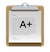
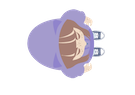

### Team-KKLHY
오픈소스 1팀 프로젝트 저장소 
#### 팀원

|링크|이름|업무|개발스테이지|
|---|-----|--------------------------|-----------|
| [GitHub](https://github.com/HwangBBang)| 황병훈 | 팀장,계획서, README작성 | Stage.#0, #1 |
| [GitHub](https://github.com/123ksj)| 김수정 | 진행현황작성 | Stage.#1, #2 |
| [GitHub](https://github.com/subsub97)| 김득호 | 개발팀장 | Stage.#1, #2 |
| [GitHub](https://github.com/YangJinHyeok) | 양진혁 | 계획서,자료조사 | Stage.#1, #3 |
| [GitHub](https://github.com/sugyeong-lee) | 이수경 | 알고리즘 및 설계도 작성 | Stage.#1, #3 |

## 1팀 사이드프로젝트를 소개합니다.

pygame 라이브러리와 git 을 사용해 게임을 개발하고 있습니다. 
게임은 크게 3가지 부분으로 나누어집니다. 

**#0. START PAGE & Record** 
> 시작화면,각스테이지에 대한 설명, 각 스테이지 시작과 끝을 연결합니다.  
> 게임을 시작하면 성적을 산출하는 방법과 기준을 명시합니다.  
>>Enter를 누르면 , 각 스테이지의 상세설명을 읽을 수 있는 페이지로 이동합니다.  
>>Spacebar를 누르면 , 스테이지 1로 이동합니다.  
>
**#1. ITEM STAGE** 
> 횡스크롤 형식의 게임이며, 여러가지 아이템들이  -x 방향으로 이동합니다.  
> 양의 점수를 주는 아이템을 획득하고 음의 점수를 주는 아이템은 회피해야하한다.  
> *60초 내에 10000점 도달* 해당 목표를 달성하면 Stage.#1 을 탈출합니다.   
> *30초를 초과* OR *5000점 이상* 일 때,   
>> 양의점수를 주는 아이템 생성빈도 Up 
>> 음의점수를 주는 아이템 생성빈도 Down 
>
> **아이템 :**  

| 값 | 이미지 |
|------|-------------------------|
| +200 | ,,, |
| -400 | ,, |

> **캐릭터 :**  
> 

**#2. MID EXAM STAGE** 
> 모든 방향에서 장애물들이 수시로 날라옵니다.  
> 다가오는 장애물들을 피해 최대한오래 생존한다면 높은 점수를 획득 할 수 있습니다.  
> 장애물과 충돌하게 되면 Stage.#2 을 탈출합니다. 
> 
> **아이템 :**  
>   

**#3. FIN EXAM STAGE** 
> 캐릭터가 과제를 발사 할 수 있습니다. 조작법은 SpaceBar 입니다.  
> 무작위로 움직이는 교수님에게 과제를 발사해 교수님의 체력을 감소시킵니다.  
> 이때 교수님의 체력이 0 이하가 되면 Stage#3 을 탈출하고 게임이 종료됩니다.  

| 이름 | HP값 | 이미지 | 
|------|---------|---------|
| 교수님 | 100 |  |
| 메인 | 100 |  |
 
| 이름 | 값 | 이미지 | 
|------|---------|---------|
| 교수님F | 10 |  |
| 메인 과제 | 2 |  |
| 힐팩 | 10 |  |

<이상 게임의 상세한 설명을 마무리 하겠습니다. 감사합니다.>  

---
## 1팀의 활동

+ 1팀은 객체지향에 대해 이해와 git에 대한 숙련도를 위해 주1회 이상 스터디를 진행합니다.
+ 1팀은 서로의 코드를 리뷰하는 시간을 갖습니다.
+ 1팀은 팀원 모두 주차별 일정을 작성하여 계획적인 프로젝트를 진행합니다.
+ 각 스테이지를 분업하여 보다 효율적으로 프로젝트를 진행합니다.
+ Visual Studio Code 의 Live Share 를 이용하여 협업 활동을 합니다.
+ git을 활용한 버전관리를 할 수 있습니다.
+ 주간회고를 통한 체계적인 진행도 관리로 목표했던 프로젝트를 성공적으로 구현하였습니다.
